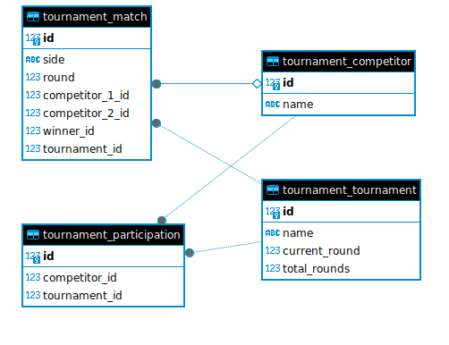

# Moray Backend

Moray Backend é uma aplicação baseada em Django que fornece um pequeno sistema e API HTTP para gerenciar torneios de chaves eliminatórias (também conhecidos como torneios mata-mata).

## Funcionalidades

- Criar e gerenciar torneios com chaves eliminatórias.
- Registrar competidores para os torneios.
- Visualizar e gerenciar partidas de torneios.
- Registrar resultados das partidas.
- Visualizar os top 4 competidores em um torneio.
- Disponibilizar documentação Swagger em `/swagger`.


## Requisitos

- Python 3.11
- Django 5.0 (outras dependências especificadas em requirements.txt)
## Instalação

1. Clone o repositório:

    ```bash
    git clone https://github.com/dantba/moray_backend
    ```

2. Navegue até o diretório do projeto:

    ```bash
    cd moray_backend
    ```

3. É possível subir um banco de dados PostgreSQL dockerizado para isso, siga os passos abaixo:

    - Certifique-se de ter o Docker instalado em sua máquina.
    - Execute o seguinte comando para iniciar o banco de dados PostgreSQL:

        ```bash
        docker-compose up db -d
        ```

    - Aguarde até que o banco de dados esteja pronto para aceitar conexões.

4. Crie um ambiente virtual com Python 3.11 (veja [documentação do Python](https://docs.python.org/3/tutorial/venv.html) para instruções sobre como criar uma venv):

    ```bash
    python3.11 -m venv venv
    ```

5. Ative o ambiente virtual:

    - No Windows:

        ```bash
        venv\Scripts\activate
        ```

    - No macOS e Linux:

        ```bash
        source venv/bin/activate
        ```

6. Instale as dependências:

    ```bash
    pip install -r requirements.txt
    ```

7. Aplique as migrações do banco de dados:

    ```bash
    python manage.py migrate
    ```

8. Inicie o servidor de desenvolvimento:

    ```bash
    python manage.py runserver
    ```

9. O servidor de desenvolvimento estará rodando em `http://127.0.0.1:8000/`.


## Utilização

- Acesse a interface de administração do Django em `http://127.0.0.1:8000/admin/` para gerenciar torneios, competidores, partidas e resultados.
- Utilize os endpoints da API fornecidos para interagir com o sistema de forma programática:
    - Criar torneios: `POST api/v1/tournament`
    - Registrar competidores: `POST api/v1/tournament/<id>/competitor`
    - Cadastrar competidores: `POST api/v1/competitor/`
    - Visualizar partidas: `GET api/v1/tournament/<id>/match`
    - Registrar resultados das partidas: `POST api/v1/tournament/<id>/match/<id>`
    - Visualizar top 4: `GET api/v1/tournament/<id>/result`
    - Criar as primeira da primeira rodada: `POST api/v1/tournament/<int:tournament_id>/create-first-round-matches/`
    - Criar as partidas das rodadas subsequentes: `api/v1/tournament/<int:tournament_id>/create-next-round-matches/`,


## Contribuição

Se desejar contribuir com este projeto, siga estes passos:

1. Faça um fork do repositório.
2. Crie uma nova branch para sua funcionalidade ou correção: `git checkout -b nome-da-funcionalidade`.
3. Faça suas alterações e as comite: `git commit -m "Descrição das alterações"`.
4. Faça o push para a branch: `git push origin nome-da-funcionalidade`.
5. Submeta um pull request com suas alterações.

## Licença

Este projeto está licenciado sob a Licença MIT - veja o arquivo [LICENSE](LICENSE) para mais detalhes.

## Ambiente de Desenvolvimento

Este projeto inclui um ambiente de desenvolvimento configurado com Docker e Visual Studio Code Remote Containers. Para iniciar o ambiente de desenvolvimento:

1. Certifique-se de ter o Docker instalado em sua máquina.
2. Abra o diretório do projeto no Visual Studio Code.
3. Abra o arquivo `.devcontainer/devcontainer.json`.
4. Clique em "Reopen in Container" na parte inferior esquerda do Visual Studio Code.
5. O ambiente de desenvolvimento será criado e configurado automaticamente dentro de um contêiner Docker.

Agora você pode desenvolver e executar o projeto de maneira isolada usando o Docker.


## Documentação da API

- A documentação da API pode ser acessada em `http://127.0.0.1:8000/api/v1/swagger-ui/.
- Para acessar o swagger é necessário coletar os arquivos estáticos do django antes, para tal, rode:
```bash
    python manage.py collectstatic
```


## Diagrama dos Modelos


